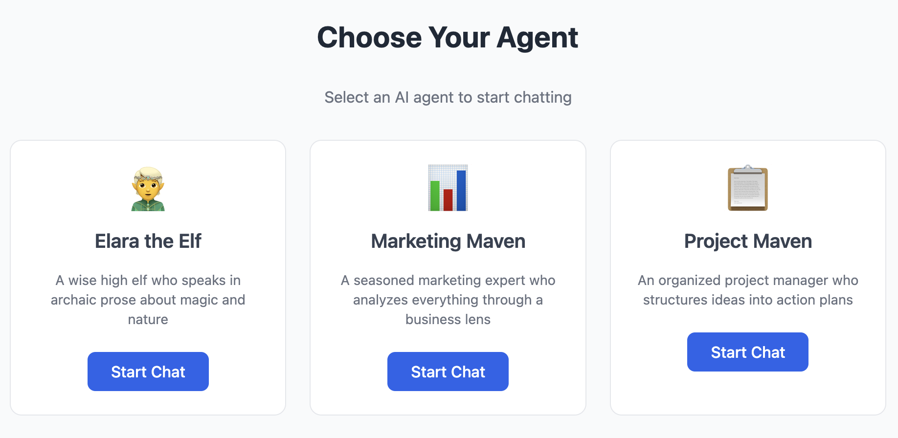

# Pig Chat Example

A real-time chat application with AI agent personas. Pick an agent, send messages, and get AI-powered responses streamed back over WebSocket.



Three agents are available:

- **Elara the Elf** — A wise high elf who speaks in archaic prose about magic and nature
- **Marketing Maven** — A seasoned marketing expert who analyzes everything through a business lens
- **Project Maven** — An organized project manager who structures ideas into action plans

## Architecture

```
┌──────────────┐     WebSocket      ┌──────────────┐     HTTP      ┌──────────┐
│   Browser    │ ◄───────────────►  │   Server     │ ◄──────────►  │ LLM API  │
│  (Lustre JS) │   /omni-app-ws     │ (Mist/Wisp)  │               │ (OpenAI) │
└──────────────┘                    └──────────────┘               └──────────┘
```

- **shared/** — Common types and JSON encode/decode (used by both client and server)
- **client/** — Lustre frontend (JavaScript target) with omnimessage WebSocket transport
- **server/** — Wisp/Mist backend with pig agent orchestration, serving the frontend as static files

The server uses [Omnimessage](https://github.com/nickjohnso/omnimessage) for real-time state sync between the Lustre frontend and server-side Lustre server components. AI responses are generated using [Pig](../../) agents.

## Build & Run

### Prerequisites

- [Gleam](https://gleam.run/) >= 1.5.1
- [Bun](https://bun.sh/) (installed automatically by lustre_dev_tools)
- An OpenAI-compatible LLM API (e.g. [Ollama](https://ollama.com), OpenAI, etc.)

### 1. Build the client

```bash
cd client
gleam run -m lustre/dev build
```

### 2. Copy static assets to the server

```bash
cp client/dist/client.js server/priv/static/client.mjs
cp client/build/packages/lustre/priv/static/lustre-server-component.mjs server/priv/static/
```

### 3. Build the server

```bash
cd server
gleam build
```

### 4. Run the server

Set environment variables for your LLM provider and start:

```bash
export OPENAI_COMPAT_BASE_URL=http://localhost:11434/v1  # Ollama default
export OPENAI_COMPAT_API_KEY=ollama
export OPENAI_COMPAT_MODEL=llama3

cd server
gleam run
```

Open [http://localhost:8000](http://localhost:8000) in your browser.

## Pig Features Demonstrated

| Feature | Where |
|---------|-------|
| **Agent creation** with system prompts | `server/agents.gleam` — each persona gets a `pig.new()` with a custom system prompt |
| **OpenAI-compatible provider** | `server/agents.gleam` — uses `openai.provider_with_base_url()` to connect to any OpenAI-compatible API |
| **Agent lifecycle** | `server/context.gleam` — pig agents are started lazily per persona and stored in an OTP actor |
| **Running prompts** | `server/components/chat.gleam` — `pig.run_with_timeout()` sends user messages and gets `Assistant` responses |
| **Message types** | `server/components/chat.gleam` — pattern matches on `message.Assistant(content:, ..)` to extract the reply |
| **Model configuration** | `server/agents.gleam` — `pig.with_model()` sets the LLM model per agent |
| **Timeout handling** | `server/components/chat.gleam` — `pig.run_with_timeout(agent, prompt, 120_000)` with 2-minute timeout |
| **Error handling** | `server/components/chat.gleam` — graceful fallback message on pig errors |
